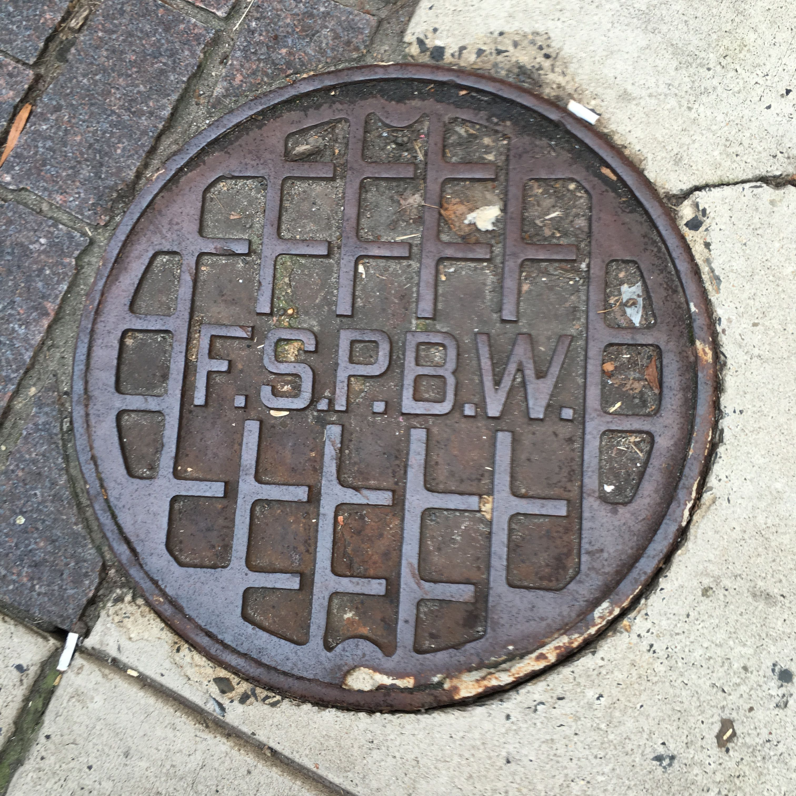
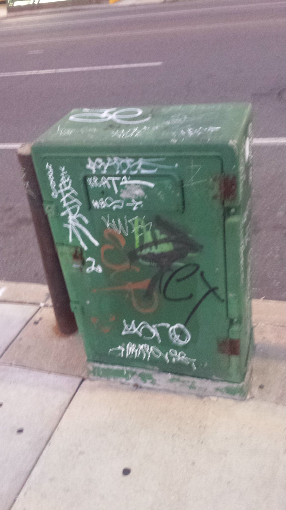

# unidentified-infrastructure-objects
For things that we can't put on the site, because we don't know what they are.

## Manholes

  
**What**: A Manhole that says "F.S.P.B.W."  
**Where**: ??  
**Discussion**: https://twitter.com/netsofphilly/status/1025821948893388802
**Explanation**: ~~Might have [something to do with the Philadelphia, Baltimore, Washington Railroad (PB&W)](https://twitter.com/netsofphilly/status/1025821948893388802).~~ Probably actually has something to do with water. Check out these images of other water-related manholes with the same checkerboard pattern [[1](images/manhole/w_0.jpg)][[2](images/manhole/hpfs_0.jpg)].

## Pedestals

  
**What**: A green pedestal with no markings.
**Where**: 22nd and Market.
**Discussion**: https://twitter.com/netsofphilly/status/1029371419413676032
**Explanation**: Not sure, might be related to the Electrical Bureau or SEPTA based on location, though green is sometimes a color for traffic signals. More pictures [[1]images/pedestal/green_1.jpg)][[2](images/pedestal/green_2.jpg)][[3](images/pedestal/green_3.jpg)].